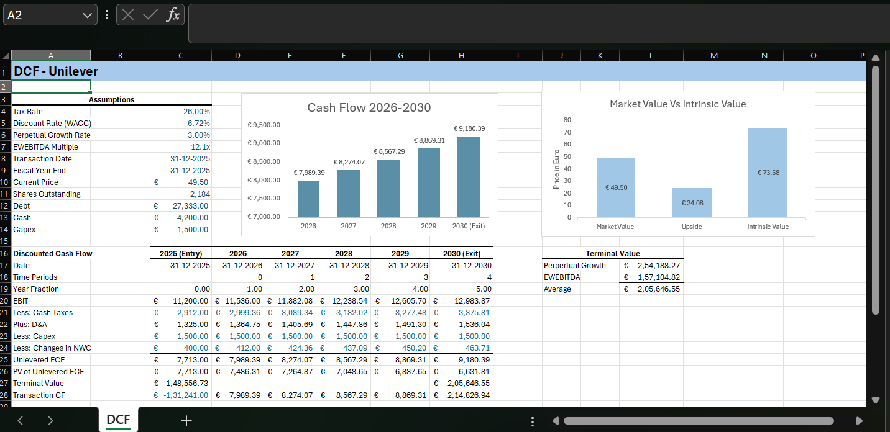
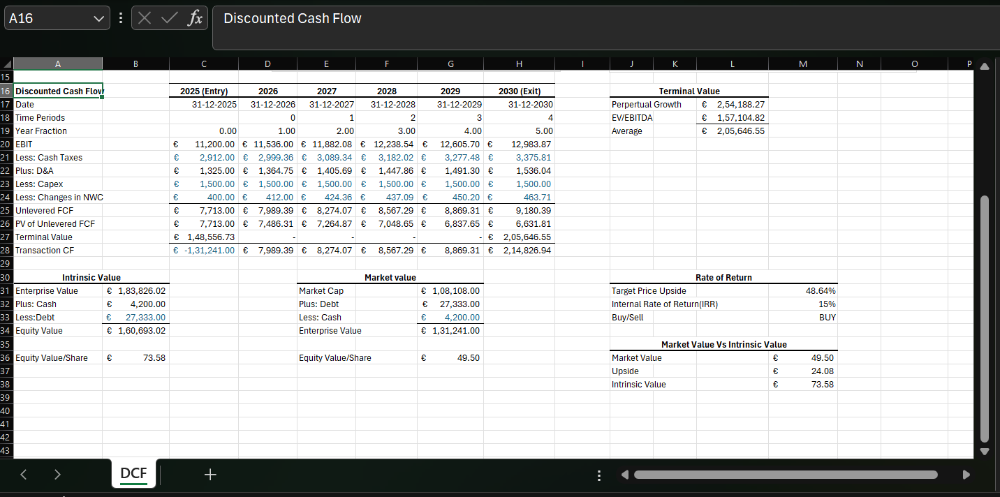

# Equity Valuation & Financial Modeling: Unilever PLC
**Intrinsic Value Analysis | 5-Year DCF Model | Decision Logic**

## 📌 Project Objective
The primary objective of this project was to determine the intrinsic value of **Unilever PLC** and generate an automated investment recommendation. By forecasting future cash flows and discounting them to the present, the model identifies whether the stock is trading at a discount or premium relative to its fundamental value.

---

## 🛠 Analysis Process & Methodology
This valuation was built using a multi-stage **Unlevered Discounted Cash Flow (DCF)** framework in Microsoft Excel, utilizing high-integrity manual data structuring:

### 1. Data Sourcing & Normalization
- **Primary Sources:** Financial data manually extracted from **Unilever’s Annual Reports (20-F)** and market pricing via **Yahoo Finance**.
- **Process:** Performed manual data cleansing and normalization to align historical income statements and balance sheets. Standardized line items across a 5-year period to ensure consistent EBIT margin and NWC (Net Working Capital) trend analysis.

### 2. Forecasting Unlevered Free Cash Flows (UFCF)
- **EBIT & Taxes:** Projected operating income based on historical performance and applied a normalized tax rate (26%).
- **Formula:** $$UFCF = EBIT \times (1 - t) + D+A - Capex - \Delta NWC$$
- **Reinvestment:** Calculated **Net Working Capital (NWC)** and **Capital Expenditures (Capex)** requirements to determine the reinvestment needed to sustain projected growth.

### 3. WACC & Terminal Value
- **Discount Rate:** Derived a **WACC of 6.72%** reflecting Unilever’s specific capital structure and risk profile.
- **Terminal Value:** Triangulated the exit value by averaging the **Perpetual Growth Method** (3.0% g) and the **Exit Multiple Method** (12.1x EV/EBITDA) to normalize for market volatility.

---

## 🔢 Technical Calculation Breakdown

### 1. Earnings Before Interest, Taxes, Depreciation, & Amortization (EBITDA)
EBITDA was used as a proxy for operating cash flow before reinvestment.
- **Formula:** `EBIT + Depreciation & Amortization`
- **Excel Application:** Summation of the Operating Profit line and non-cash D&A charges found in the Cash Flow Statement.

### 2. Change in Net Working Capital (ΔNWC)
This measures the cash tied up in day-to-day operations. 
- **Formula:** `(Current Assets - Cash) - (Current Liabilities - Short-term Debt)`
- **Impact:** An increase in NWC represents a cash outflow, which was subtracted from the Unlevered Free Cash Flow.

### 3. The Equity Bridge
To arrive at the **Implied Share Price**, the Enterprise Value was adjusted as follows:
- `(+) Cash & Cash Equivalents ($4.2B)`
- `(-) Total Debt ($27.3B)`
- `(=) Total Equity Value`
- `(/) Diluted Shares Outstanding`

### 4. Automated Investment Logic
The model utilizes a dynamic **IF-clause** to generate an instantaneous investment recommendation. By comparing the **Implied Fair Value** against the **Current Market Price**, the model triggers a:
- **"BUY"** recommendation if the projected upside exceeds a 10% margin of safety.
- **"SELL/HOLD"** recommendation if the asset is trading at or above intrinsic value.

---

## 📊 Valuation Dashboard & Findings

### DCF Valuation Summary
The dashboard provides a clear view of the Enterprise Value to Equity Value bridge and the final recommendation.

## 📈 Key Findings & KPIs
* **Intrinsic Value:** The model implies a fair value significantly higher than the current market entry point.
* **Projected Upside:** Identified a **48.6% upside potential**.
* **Recommendation:** **BUY** — The automated logic confirms Unilever is undervalued relative to its free cash flow generation.
* **Capital Efficiency:** The model highlights a disciplined Capex-to-Sales ratio and optimized NWC management as key drivers of value.

---

## 💻 Software & Technical Requirements
- **Microsoft Excel 2019 or Later:** Support for dynamic arrays and modern financial functions.
- **Data Analysis Toolpak:** (Optional) Enabled for statistical validation of historical growth trends.
- **Advanced Formula Usage:** Implementation of **XIRR** for return metrics and **OFFSET** for dynamic scenario toggling between terminal value methods.

## 📂 Repository Contents
* **`DCF_Model_Unilever.xlsx`**: The complete dynamic model featuring automated logic and financial schedules.
* **`DCF_Model_Data_Unilever.csv`**: Cleaned dataset of historical financials used for the model projections.
* **`visuals`**: A dedicated directory containing high-resolution screenshots of the model's core components.

---
**Keywords:** `Equity-Valuation` `DCF` `Unilever` `WACC` `Financial-Modeling` `Intrinsic-Value` `Excel` `Corporate-Finance` `Investment-Banking`
